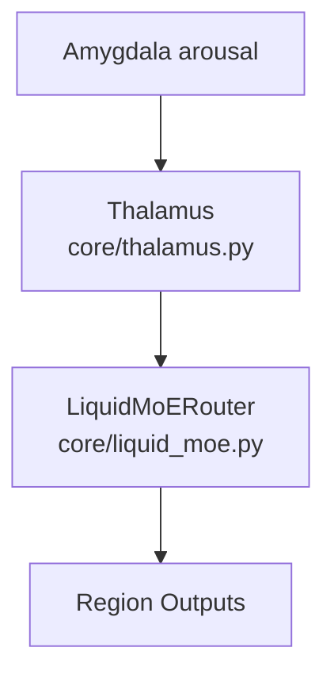
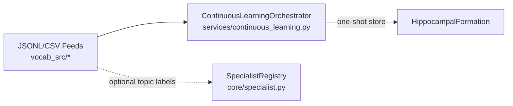

# Aura Model Architecture

This document outlines the major components and how they interact. Mermaid diagrams provide a high-level view; details live in the code (paths noted).

## Core Data Flow (Training/Inference)

```mermaid
flowchart TD
    subgraph Input
        A[Token IDs]
    end
    subgraph Encoding
        PCE[PlaceCellSemanticEncoder<br/>core/language_zone/place_cell_encoder.py]
        TGE[ThetaGammaPositionalEncoding<br/>core/language_zone/theta_gamma_encoding.py]
    end
    subgraph Transformer
        HTL[HippocampalTransformerLayer × N<br/>core/language_zone/hippocampal_layer.py]
        ATT[HippocampalProsodyAttention<br/>core/language_zone/hippocampal_attention.py]
        FFN[FFN (ANN) or Hybrid/SNN<br/>core/language_zone/snn_ffn.py]
    end
    subgraph Memory
        HF[HippocampalFormation<br/>core/hippocampal.py]
    end
    subgraph Output
        LMH[Language Head<br/>tied to embeddings]
    end
    A --> PCE --> TGE --> HTL --> LMH
    HF <--> HTL
    HF -. store/retrieve .-> HF
    ATT -. prosody gate .-> HTL
```

**Notes**
- Hippocampal memory is stored/retrieved inside `HippocampalTransformerLayer` via `HippocampalProsodyAttention` and gating logic.
- Output head shares weights with token embeddings.

## Limbic & Endocrine Modulation (Current Wiring)

```mermaid
flowchart LR
    AMY[Amygdala<br/>core/limbic_system.py]
    PROS[Prosody Tensor<br/>(arousal/valence)]
    ATT[Prosody Attention<br/>core/language_zone/hippocampal_attention.py]
    ENDO[EndocrineSystem<br/>core/endocrine.py]
    LR[LR / Memory Gate Scalers]

    AMY --> PROS --> ATT
    ENDO --> LR -->|scales LR & memory on/off| ATT
```

**Current effects (colab_l4_training.py)**
- Amygdala: computes arousal/valence from token embeddings; passed as prosody to attention.
- Endocrine: uses loss-derived proxies to adjust LR slightly and gate memory usage (norepinephrine vs cortisol).

## Optional Routing Components



**Status**: Thalamus/LiquidMoE are available for sensory gating and routing but are not in the default LM training path. They can gate inputs using limbic arousal and dispatch to cortical regions.

## Continuous Learning / Episodic Seeding



**Notes**
- Ingest helpers in `colab_l4_training.py` stream JSONL/CSV examples into episodic memory.
- Specialists can be auto-created from topic labels via `SpecialistRegistry.ensure_from_topics`.

## Specialists (Optional)

```mermaid
flowchart LR
    TOPICS[Topic Labels]
    REG[SpecialistRegistry]
    SPEC[Specialists (NLMS adapters)]
    DATA[Topic Batches]

    TOPICS --> REG --> SPEC
    DATA --> SPEC -->|adapt| SPEC
```

**Status**: Specialists are off by default; create via `ensure_from_topics` and adapt per topic.

## Key File Map
- Language stack: `core/language_zone/*` (encoders, attention, transformer).
- Memory: `core/hippocampal.py`.
- Limbic: `core/limbic_system.py` (Amygdala).
- Endocrine: `core/endocrine.py`.
- Routing: `core/thalamus.py`, `core/liquid_moe.py`.
- Specialists: `core/specialist.py`.
- Training harness: `colab_l4_training.py` (Colab-ready).
- Continuous learning: `services/continuous_learning.py`.
